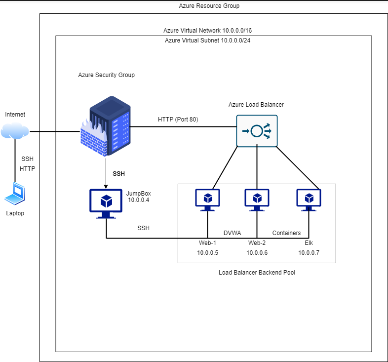

# Elk-Stack-Project
The configuration of an ELK Stack server in order to set up a cloud monitoring system.

## Automated ELK Stack Deployment

The files in this repository were used to configure the network depicted below.



These files have been tested and used to generate a live ELK deployment on Azure. They can be used to either recreate the entire deployment pictured above. Alternatively, select portions of the select file may be used to install only certain pieces of it, such as Filebeat.

  - [Anisble Playbook](https://github.com/jcphillips51/Elk-Stack-Project/blob/main/Ansible/pentest.yml)
  - [Metricbeat Playbook](https://github.com/jcphillips51/Elk-Stack-Project/blob/main/Ansible/metricbeat-playbook.yml)
  - [Filebeat Playbook](https://github.com/jcphillips51/Elk-Stack-Project/blob/main/Ansible/Filebeat-playbook.yml) 


This document contains the following details:
- Description of the Topologu
- Access Policies
- ELK Configuration
  - Beats in Use
  - Machines Being Monitored
- How to Use the Ansible Build


### Description of the Topology

The main purpose of this network is to expose a load-balanced and monitored instance of DVWA, the D*mn Vulnerable Web Application.

Load balancing ensures that the application will be highly available, in addition to restricting access to the network.
- The load balancer analyzes incoming traffic and then determines what server to send it to. This makes it very useful against denial of service attacks(DDoS).
- The Jump Box is useful because it can limit the access of the public to your virtual network. 

Integrating an ELK server allows users to easily monitor the vulnerable VMs for changes to the files and system logs.
- Filebeat watches for any changes to the files on the server. 
- Metricbeat records the operating system and services on the server. 

The configuration details of each machine may be found below.

| Name     | Function | IP Address | Operating System |
|----------|----------|------------|------------------|
| JumpBox  | Gateway  | 10.0.0.1   | Linux            |
| Web-1    | Websever | 10.0.0.4   | Linux            |
| Web-2    | Webserver| 10.0.0.5   | Linux            |
| Elk-VM   | Webserver| 10.1.0.4   | Linux            |

### Access Policies

The machines on the internal network are not exposed to the public Internet. 

Only the JumpBox machine can accept connections from the Internet. Access to this machine is only allowed from the following IP addresses:
- main machine public IP

Machines within the network can only be accessed by JumpBox-VM.
- JumpBox-VM: 10.0.0.1

A summary of the access policies in place can be found in the table below.

| Name     | Publicly Accessible | Allowed IP Addresses |
|----------|---------------------|----------------------|
| JumpBox  | Yes                 | Main Machine         |
| Web-1    | NO                  | 10.0.0.1             |
| Web-2    | NO                  | 10.0.0.1             |
| Elk-VM   | NO                  | 10.0.0.1             |
### Elk Configuration

Ansible was used to automate configuration of the ELK machine. No configuration was performed manually, which is advantageous because...
- The Advantage of automating configuration with ansible is preventing from having to configure Elk manually. This not only streamlined the process, but deployes a     reliable and efficient Elk server.


The playbook implements the following tasks:
- [Elk Playbook](https://github.com/jcphillips51/Elk-Stack-Project/blob/main/Ansible/install-elk.yml)
- Installs docker.io
```yml
- name: Install docker.io
      apt:
        update_cache: yes
        name: docker.io
        state: present
```
- Installs pip3 & docker module
```yml
- name: Install pip3
      apt:
        force_apt_get: yes
        name: python3-pip
        state: present

    - name: Install Docker python module
      pip:
        name: docker
        state: present
```
- Increases memory
```yml
   - name: Use more memory
      sysctl:
        name: vm.max_map_count
        value: "262144"
        state: present
        reload: yes
```
- Downloads and lanches elk container 
```yml
- name: download and launch a docker elk container
      docker_container:
        name: elk
        image: sebp/elk:761
        state: started
        restart_policy: always
        published_ports:
          - 5601:5601
          - 9200:9200
          - 5044:5044
```
- Enable service docker on boot
```yml
- name: Enable service docker on boot
      systemd:
        name: docker
        enabled: yes
```
The following screenshot displays the result of running `docker ps` after successfully configuring the ELK instance.


### Target Machines & Beats
This ELK server is configured to monitor the following machines:
- Web-1: 10.0.0.4
- Web-2: 10.0.0.5

We have installed the following Beats on these machines:
- Filebeat
- Metricbeat

These Beats allow us to collect the following information from each machine:
- Filebeat is a shipper for forwarding and centralizing log data. It can monitor log files and locations that the user specifies. It can also collect log events then forwards them to elasticsearch or logstash for indexing. 
- Metricbeat is a shipper that you install on your server to collect metrics from the operating system from the services on the server. Metricbeats takes those metrics ands statistics and sends them to the output the user specifies.  

### Using the Playbook
In order to use the playbook, you will need to have an Ansible control node already configured. Assuming you have such a control node provisioned: 

SSH into the control node and follow the steps below:
- Copy the [install-elk.yml](https://github.com/jcphillips51/Elk-Stack-Project/blob/main/Ansible/install-elk.yml) file to /etc/ansible/files.
- Update the [host.yml](https://github.com/jcphillips51/Elk-Stack-Project/blob/main/Ansible/host.yml) file to include IP addresses for the webservers and the ELK server.
```yml
[webservers]
10.1.0.5 ansible_python_interpreter=/usr/bin/python3
10.1.0.6 ansible_python_interpreter=/usr/bin/python3


[elk]
10.2.0.4 ansible_python_interpreter=/usr/bin/python3
```
- Run the playbook, and navigate to Kibana to check that the installation worked as expected.
- URL to test Elk server: http://[Host IP]/app/kibana
